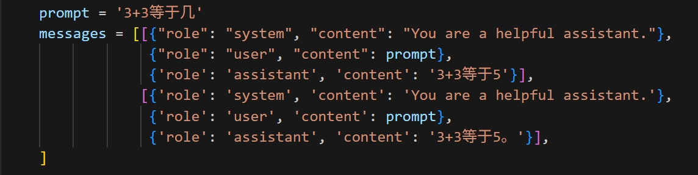

# SFT & DPO on Qwen2.5-3B-Instruct

In this repo, I use the Qwen2.5-3B-Instruct model to show how SFT and DPO works. The model is free available on modelscope.

Using RTX 4070 laptop GPU with 8GB memory. Pytorch version 2.1.0

## SFT at Glance

To teach a model to generate a response to a given prompt, we can give some designated question-answer pairs to the model. Here, I deliberately teach the model `3+3=5` by giving model the following prompt:

Thus, after the SFT process, for the particular tasks, the results of which given by the sft-ed model are aligned with the given reference. When comes to other tasks that not in SFT material, the model still works correctly.

SFT progress in 100 epochs*:

*: Model may overfitted.

## DPO

DPO used to train the model so that the model can generate in a particular style, so to speak. For example, if we have two correct answers for a question but they are in different styles, we can use DPO to train the model to favour a certain style over another.

*Insuffienct CUDA memory leads this experiment to fail.*
